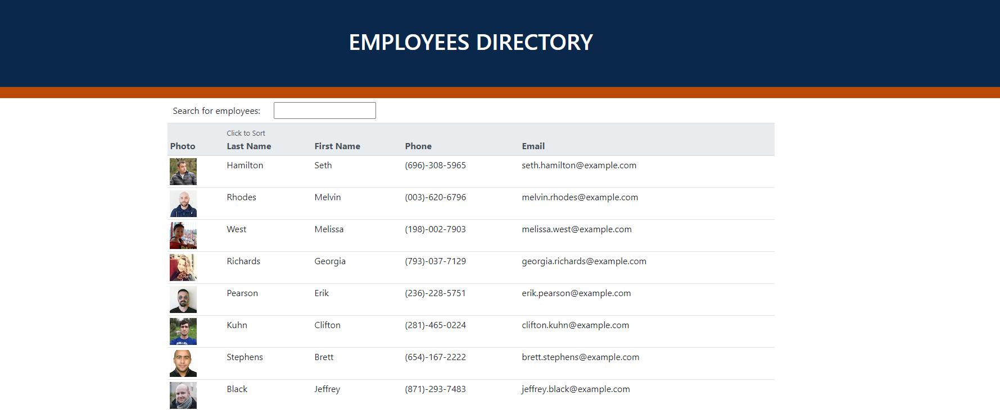
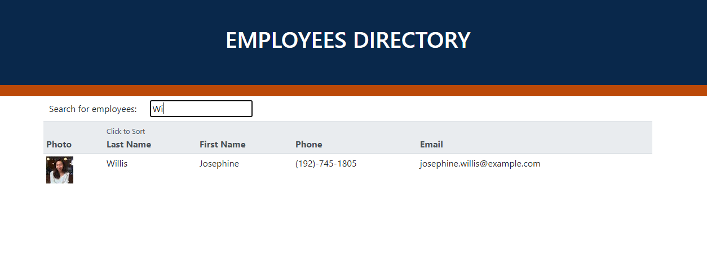

# Employee Directory 

This application is a emlpoyee directory. An API return a bunch of random people and displays them in a table. As the user inputs a letter in the input box, it will filter all the employees that have the letter in their names. When you click on sort by last name it will sort all the employees by their last name.

## Screenshots

 
## Demo

Link to demo video: https://youtu.be/YFI0v5APje8
